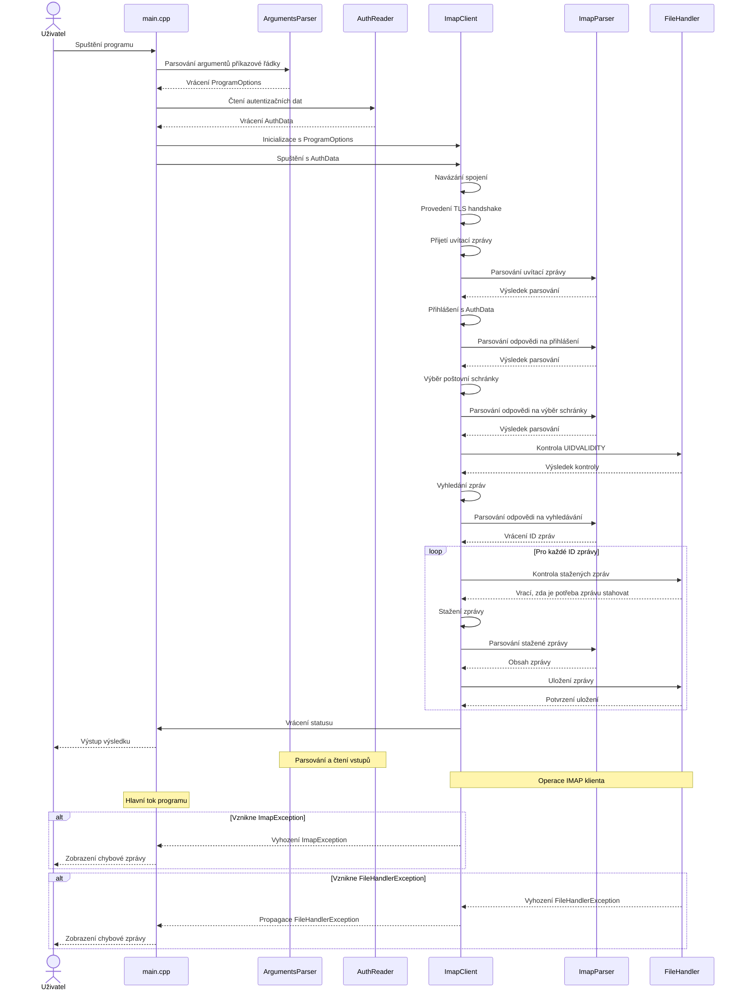

### Sequence diagram

```mermaid
sequenceDiagram
  actor User as Uživatel
  participant Main as main.cpp
  participant ArgsParser as ArgumentsParser
  participant AuthReader as AuthReader
  participant ImapClient as ImapClient
  participant ImapParser as ImapParser
  participant FileHandler as FileHandler
  User ->> Main: Spuštění programu
  Main ->> ArgsParser: Parsování argumentů příkazové řádky
  ArgsParser -->> Main: Vrácení ProgramOptions
  Main ->> AuthReader: Čtení autentizačních dat
  AuthReader -->> Main: Vrácení AuthData
  Main ->> ImapClient: Inicializace s ProgramOptions
  Main ->> ImapClient: Spuštění s AuthData
  ImapClient ->> ImapClient: Navázání spojení
  ImapClient ->> ImapClient: Provedení TLS handshake
  ImapClient ->> ImapClient: Přijetí uvítací zprávy
  ImapClient ->> ImapParser: Parsování uvítací zprávy
  ImapParser -->> ImapClient: Výsledek parsování
  ImapClient ->> ImapClient: Přihlášení s AuthData
  ImapClient ->> ImapParser: Parsování odpovědi na přihlášení
  ImapParser -->> ImapClient: Výsledek parsování
  ImapClient ->> ImapClient: Výběr poštovní schránky
  ImapClient ->> ImapParser: Parsování odpovědi na výběr schránky
  ImapParser -->> ImapClient: Výsledek parsování
  ImapClient ->> FileHandler: Kontrola UIDVALIDITY
  FileHandler -->> ImapClient: Výsledek kontroly
  ImapClient ->> ImapClient: Vyhledání zpráv
  ImapClient ->> ImapParser: Parsování odpovědi na vyhledávání
  ImapParser -->> ImapClient: Vrácení ID zpráv
  loop Pro každé ID zprávy
    ImapClient ->> FileHandler: Kontrola stažených zpráv
    FileHandler -->> ImapClient: Vrací, zda je potřeba zprávu stahovat
    ImapClient ->> ImapClient: Stažení zprávy
    ImapClient ->> ImapParser: Parsování stažené zprávy
    ImapParser -->> ImapClient: Obsah zprávy
    ImapClient ->> FileHandler: Uložení zprávy
    FileHandler -->> ImapClient: Potvrzení uložení
  end
  ImapClient ->> Main: Vrácení statusu
  Main -->> User: Výstup výsledku
  Note over ArgsParser, AuthReader: Parsování a čtení vstupů
  Note over ImapClient, FileHandler: Operace IMAP klienta
  Note over Main: Hlavní tok programu
  alt Vznikne ImapException
    ImapClient -->> Main: Vyhození ImapException
    Main -->> User: Zobrazení chybové zprávy
  end
  alt Vznikne FileHandlerException
    FileHandler -->> ImapClient: Vyhození FileHandlerException
    ImapClient -->> Main: Propagace FileHandlerException
    Main -->> User: Zobrazení chybové zprávy
  end
```