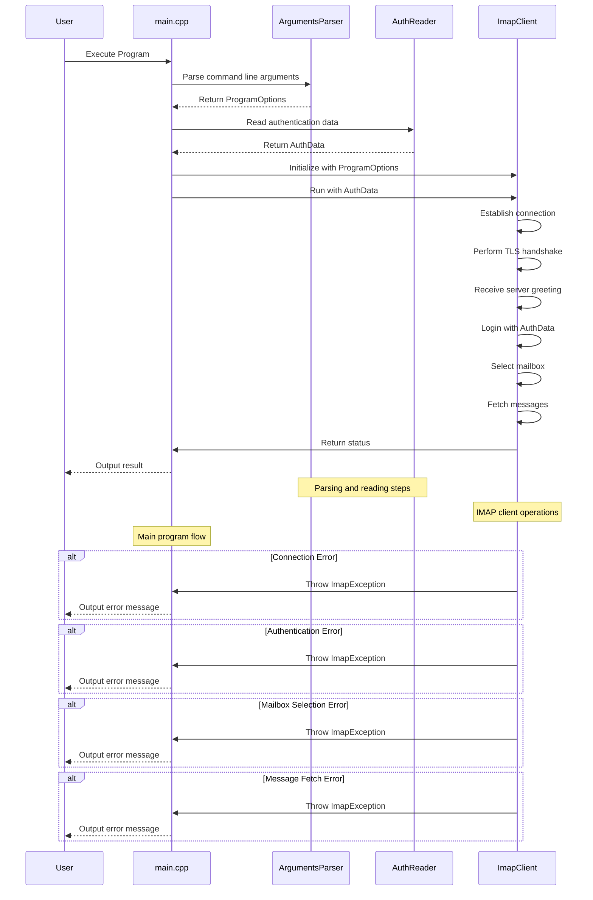

### Sequence diagram

```mermaid
sequenceDiagram
    participant User
    participant Main as main.cpp
    participant ArgsParser as ArgumentsParser
    participant AuthReader as AuthReader
    participant ImapClient as ImapClient

    User->>Main: Execute Program
    Main->>ArgsParser: Parse command line arguments
    ArgsParser-->>Main: Return ProgramOptions
    Main->>AuthReader: Read authentication data
    AuthReader-->>Main: Return AuthData
    Main->>ImapClient: Initialize with ProgramOptions
    Main->>ImapClient: Run with AuthData
    ImapClient->>ImapClient: Establish connection
    ImapClient->>ImapClient: Perform TLS handshake
    ImapClient->>ImapClient: Receive server greeting
    ImapClient->>ImapClient: Login with AuthData
    ImapClient->>ImapClient: Select mailbox
    ImapClient->>ImapClient: Fetch messages
    ImapClient->>Main: Return status
    Main-->>User: Output result

    note over ArgsParser,AuthReader: Parsing and reading steps
    note over ImapClient: IMAP client operations
    note over Main: Main program flow

    alt Connection Error
        ImapClient->>Main: Throw ImapException
        Main-->>User: Output error message
    end

    alt Authentication Error
        ImapClient->>Main: Throw ImapException
        Main-->>User: Output error message
    end

    alt Mailbox Selection Error
        ImapClient->>Main: Throw ImapException
        Main-->>User: Output error message
    end

    alt Message Fetch Error
        ImapClient->>Main: Throw ImapException
        Main-->>User: Output error message
    end
```