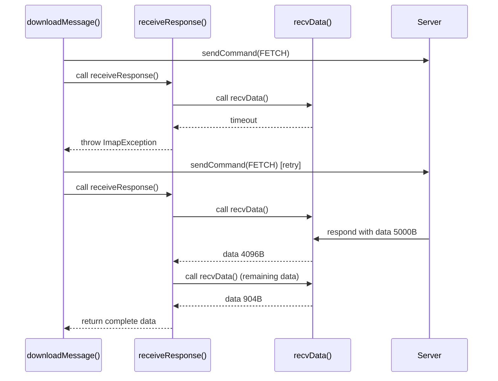

```mermaid
sequenceDiagram
    participant DM as downloadMessage()
    participant RR as receiveResponse()
    participant RD as recvData()
    participant Server as Server

    DM->>Server: sendCommand(FETCH)
    DM->>RR: call receiveResponse()
    RR->>RD: call recvData()
    RD-->>RR: timeout
    RR-->>DM: throw ImapException
    DM->>Server: sendCommand(FETCH) [retry]
    DM->>RR: call receiveResponse()
    RR->>RD: call recvData()
    Server->>RD: respond with data 5000B
    RD-->>RR: data 4096B
    RR->>RD: call recvData() (remaining data)
    RD-->>RR: data 904B
    RR-->>DM: return complete data
```