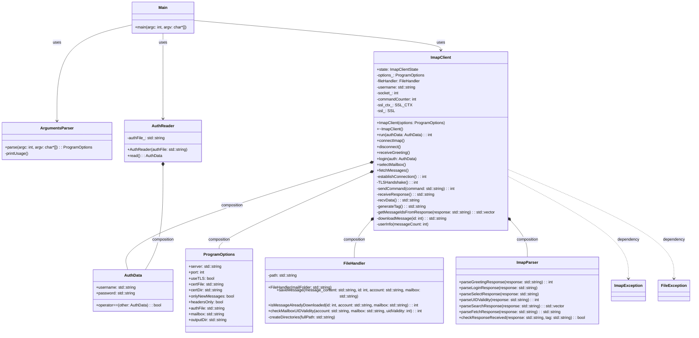

```mermaid
classDiagram
    class Main {
        +main(argc: int, argv: char*[])
    }
    class ArgumentsParser {
        +parse(argc: int, argv: char*[]): ProgramOptions
        -printUsage()
    }
    class AuthReader {
        +AuthReader(authFile: std::string)
        +read(): AuthData
        -authFile_: std::string
    }
    class ImapClient {
        +ImapClient(options: ProgramOptions)
        +~ImapClient()
        +run(authData: AuthData): int
        +connectImap()
        +disconnect()
        +receiveGreeting()
        +login(auth: AuthData)
        +selectMailbox()
        +fetchMessages()
        +state: ImapClientState
        -options_: ProgramOptions
        -fileHandler: FileHandler
        -username: std::string
        -socket_: int
        -commandCounter: int
        -ssl_ctx_: SSL_CTX
        -ssl_: SSL
        -establishConnection(): int
        -TLSHandshake(): int
        -sendCommand(command: std::string): int
        -receiveResponse(): std::string
        -recvData(): std::string
        -generateTag(): std::string
        -getMessageIdsFromResponse(response: std::string): std::vector<int>
        -downloadMessage(id: int): std::string
        -userInfo(messageCount: int)
    }
    class ProgramOptions {
        +server: std::string
        +port: int
        +useTLS: bool
        +certFile: std::string
        +certDir: std::string
        +onlyNewMessages: bool
        +headersOnly: bool
        +authFile: std::string
        +mailbox: std::string
        +outputDir: std::string
    }
    class FileHandler {
        +FileHandler(mailFolder: std::string)
        +saveMessage(message_content: std::string, id: int, account: std::string, mailbox: std::string)
        +isMessageAlreadyDownloaded(id: int, account: std::string, mailbox: std::string): int
        +checkMailboxUIDValidity(account: std::string, mailbox: std::string, uidValidity: int): int
        -path: std::string
        -createDirectories(fullPath: std::string)
    }
    class ImapParser {
        +parseGreetingResponse(response: std::string): int
        +parseLoginResponse(response: std::string)
        +parseSelectResponse(response: std::string)
        +parseUIDValidity(response: std::string): int
        +parseSearchResponse(response: std::string): std::vector<int>
        +parseFetchResponse(response: std::string): std::string
        +checkResponseReceived(response: std::string, tag: std::string): bool
    }
    class AuthData {
        +username: std::string
        +password: std::string
        +operator==(other: AuthData): bool
    }
    class ImapException {
    }
    class FileException {
    }
    Main --> ArgumentsParser : uses
    Main --> AuthReader : uses
    Main --> ImapClient : uses
    ImapClient *-- ProgramOptions : composition
    ImapClient *-- FileHandler : composition
    ImapClient *-- ImapParser : composition
    ImapClient *-- AuthData : composition
    ImapClient ..> ImapException : dependency
    ImapClient ..> FileException : dependency
    AuthReader *-- AuthData : composition
```